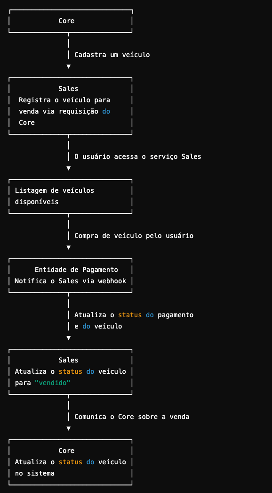

# Tech Challenge FIAP Fase 4
Projeto Fase 4 da pós graduação da FIAP de Arquitetura de Software

### Grupo 2 - Membros:
* RM353122 - Fabrício Guimarães de Oliveira - email: fguimaraesoliveira@gmail.com

# Repositórios relacionados
* [Serviço de veiculo_core](https://github.com/FabricioGuimaraesOliveira/vehicle-core-fiap-service)
* [Serviço de veiculo_venda](https://github.com/FabricioGuimaraesOliveira/vehicle-sales-fiap-service)
* [Infraestrutura Terraform](https://github.com/FabricioGuimaraesOliveira/vehicle-terraform)

## Dependências
* [IntelliJ IDEA (Opcional)](https://www.jetbrains.com/idea/download/#section=windows)
* [Java JDK 21](https://www.oracle.com/java/technologies/javase/jdk21-archive-downloads.html)
* [Spring Boot 3.1.0](https://spring.io/projects/spring-boot)
* [PostgreSql](https://www.postgresql.org/download/)
* [Maven](https://maven.apache.org/)
* [Docker](https://www.docker.com/)


## Executando aplicação completa via docker

Execute o comando abaixo para iniciar os containers com a base de dados e executar a aplicação localmente.

```bash
docker-compose up -d
```

## Endpoints
Para visualizar os endpoints disponíveis na aplicação basta acessar o swagger em [http://localhost:8080/swagger-ui/index.html](http://localhost:8080/swagger-ui/index.html)


## Funcionamento dos Serviços Core e Sales
A arquitetura da solução é baseada em microsserviços, onde dois principais serviços, Core e Sales, desempenham papéis distintos mas complementares. A comunicação entre eles utiliza requisições HTTP e ambos os serviços estão desacoplados, possibilitando escalabilidade independente.

## Serviço Vehicle Core
Responsável pelas funcionalidades centrais da plataforma, que incluem o gerenciamento de dados dos veículos. Ele serve como ponto de verdade para o cadastro e edição de veículos. Este serviço utiliza um banco de dados PostgreSQL para persistência de informações.

Principais Funcionalidades:
Cadastro de Veículo:
Endpoint: POST /vehicles
Permite o registro de um veículo para venda, com informações como marca, modelo, ano, cor e preço.
Edição de Veículo:
Endpoint: PUT /vehicles/{id}
Permite a edição de detalhes de um veículo existente.

## Serviço Vehicle Sales
Focado nas funcionalidades de venda de veículos. Ele isola o fluxo de compra e listagem de veículos disponíveis ou vendidos. Este serviço utiliza um banco de dados DynamoDB, ideal para suportar altos volumes de leitura/escrita.

Principais Funcionalidades:
Listagem de Veículos Disponíveis:
Endpoint: GET /sales/vehicles/available
Lista os veículos à venda, ordenados do mais barato para o mais caro.
Listagem de Veículos Vendidos:
Endpoint: GET /sales/vehicles/sold
Lista os veículos vendidos, ordenados do mais barato para o mais caro.
Venda de Veículo:
Endpoint: POST /sales/vehicles/sell
Registra a venda de um veículo, incluindo CPF do comprador e data da venda.
Webhook de Pagamento:
Endpoint: POST /sales/webhook/{paymentCode}
Recebe notificações da entidade de pagamento para atualizar o status da transação (aprovado/cancelado) e o status do veículo.

## Comunicação Entre os Serviços

Os serviços core e sales se comunicam via requisições HTTP

## Fluxo de Eventos

* Core cadastra um veículo.
* Core envia uma requisição ao sales para registrar o veículo para venda.
* O usuário acessa o sales para listar veículos disponíveis.
* O usuário realiza a compra de um veículo.
* Entidade de pagamento notifica o sales via webhook.
* Sales atualiza o status do pagamento e do veículo
* Quando um veículo é vendido, o sales atualiza o status para "vendido" e comunica o core.


## Fluxo de Eventos



